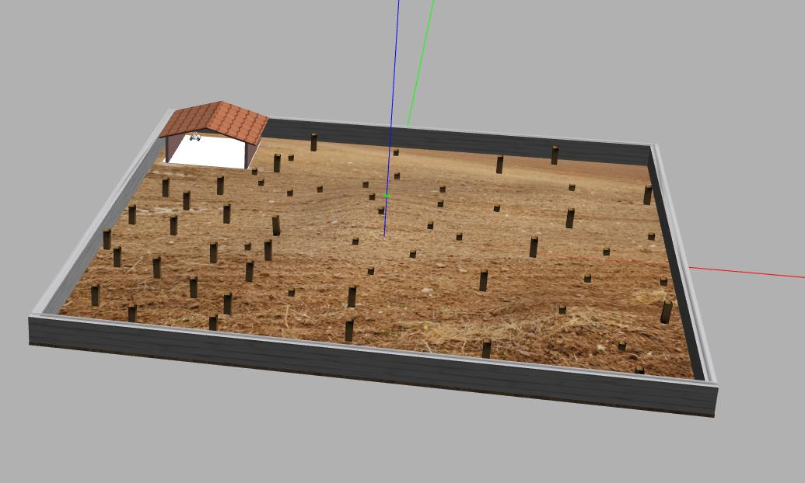

# Описание некоторых элементов решения можно найти в файле 
[SOLUTION.md](SOLUTION.md)

# Задание полуфинала олимпиады "Я - профессионал" 2022-2023 по робототехнике
[](https://t.me/iprofirobots)    [](https://yandex.ru/profi/profile/?page=contests)  [](mailto:iprofi.robotics@yandex.ru)

---


---

Репозиторий содержит ROS-пакет с минимальным *решением* задачи. Участнику следует, модифицируя этот пакет, решить задачу.

## Задача

Дано картофельное поле в сезон сбора урожая. Поле по его периметру обнесено непреодолимым забором, поверхность поля имеет рельеф с ограниченным перепадом высот и ангар (складское помещение). Для транспортировки урожая картошки в ангар доступен мобильный колесный робот. Предполагается, что урожай картофеля расфасован по мешкам и некоторым образом распределен по поверхности поля.

Участникам предлагается, с использованием доступного робота, реализовать алгоритм управления, который позволит собрать наибольшее число мешков с картошкой и переместить их в ангар.

В закрытых тестовых сценариях могут быть изменены конфигурация статических препятствий, форма поверхности поля и расположение мешков.

Требуется разработать техническое решение, включая алгоритмическое и программное обеспечения системы управления и обработки сенсорной информации, в форме программного пакета для ROS на языках программирования С++ и/или Python.


## Как все работает

Для решения задачи доступны два read-only docker-образа:

- [base] `registry.gitlab.com/beerlab/iprofi2023/problem/bachelor_problem_2023/base:ubuntu-latest` -- включает все зависимости.

- [scene] `registry.gitlab.com/beerlab/iprofi2023/problem/bachelor_problem_2023/scene:ubuntu-latest` -- собран на базе предыдущего и дополнительно включает файлы сцены в gazebo.

Запуск включает два шага:
- В контейнере сервиса `scene` на основе образа `[scene]` запускается сцена в симуляторе gazebo [bachelor_problem_scene](https://gitlab.com/beerlab/iprofi2023_dev/problem/bachelor_scene).
- В контейнере сервиса `problem` на основе образа `[base]` запускается решение [bachelor_problem_2023](https://gitlab.com/beerlab/iprofi2023/problem/bachelor_problem_2023).

Для автоматизации запуска запуска docker-контейнеров используется инструмент docker compose. Описание параметров запуска доступно в: `docker-compose.yml `.

*Note! Если вы используется систему с GPU от Nvidia, доступны версии образов с тегом `nvidia-latest` и `docker-compose.nvidia.yml`x*


## Установка и настройка окружения

Для настройки окружения необходимо иметь одну из перечисленных операционных систем:
1. Ubuntu 18.04 и старше
2. Windows 10 и старше, с установленным WSL (Не рекомендуется).

Для подготовки окружения необходимо сделать следующее:
1. Установить docker-engine: [Docker Engine](https://docs.docker.com/engine/install/ubuntu/).  
2. Также необходимо установить docker-compose-plugin: [Docker Compose](https://docs.docker.com/compose/install/linux/).  
3. Если вы планируете использовать видеокарту, установите также nviidia-container-toolkit: [Nvidia Container Toolkit](https://docs.nvidia.com/datacenter/cloud-native/container-toolkit/install-guide.html)
4. Добавить в группу docker пользователя

    ```bash
    sudo groupadd docker 
    sudo usermod -aG docker $USER 
    newgrp docker
    ```


## Как запустить начальное(базовое решение)
**Сделать форк репозитория** в корень gitlab своего юзера, **не изменяя имени репозитория**.  
Склонировать репозиторий:

```bash
git clone https://gitlab.com/<YOUR_NAME>/bachelor_problem_2023.git
cd bachelor_problem_2023
```

Дать права для подключения пользователю root к дисплею хоста:

```
xhost +local:docker
```

Запустить сцену и ros-пакет из этого репозитория:

```bash
docker compose -f docker-compose.yml up --build --pull always
```
*Note!* В файле `docker-compose.yml` хранится описание параметров запуска сцены и решения. По умолчанию запускается `example_node`

```bash
rosrun bachelor_problem_2023 example_node
```

### Редактирование базового решения
Для редактирования доступны все файлы в репозтории, за исключение файлов `docker-compose*.yml`.  
Чтобы начать решать задание вы можете отредактировать файл `start.launch` выбрав запуск python или C++ версии программы решения. 

Если вы пишете на python, нужно, чтобы в `start.launch` была раскомментирована строка: 

    <node name="example_node" pkg="bachelor" type="example.py" output="screen"></node>

Если вы пишете на C++, нужно, чтобы в `start.launch` была раскомментирована строка: 

    <node name="example_node" pkg="bachelor" type="example_node" output="screen"></node>

## Дополнительные полезные команды

В случае необходимости пересборки используйте флаг `--build`:

    docker compose -f docker-compose.yml up --build

Для получения последней версии сцены (обновления) используейте флаг `--pull always`:

    docker compose -f docker-compose.yml up --build --pull always

### Подключение в контейнер

Для открытия новой bash-сессии в сервисе решения: `problem` используйте команду:

    docker compose exec problem bash

Для открытия новой bash-сессии в сервисе сцены: `scene` используйте команду:

    docker compose exec scene bash

### Рестарт сцены или решения по отдельности
Для перезапуска **решения** используйте:

    docker compose restart problem

Для перезапуска **сцены** используйте:

    docker compose restart scene


## Оценка
Оценивается количество перемещенных мешков с картошкой с поля в ангар, а также колличество подобранных мешков. Одновременно на машину может быть загружено не более 3 мешков. 
**Колличество мешков картошки в багажнике можно узнать обратившись к топику `/number_of_bags`**.

Баллы начисляются следующим образом:  
\+  0.5 балла -- за каждый взятый мешок  
\+  0.5 балла -- за каждый доставленный мешок  
\-  0.1 балла -- за каждое столкновение с препятствиями  

Время, которое дается роботу на выполнение задания **10 минут**.

