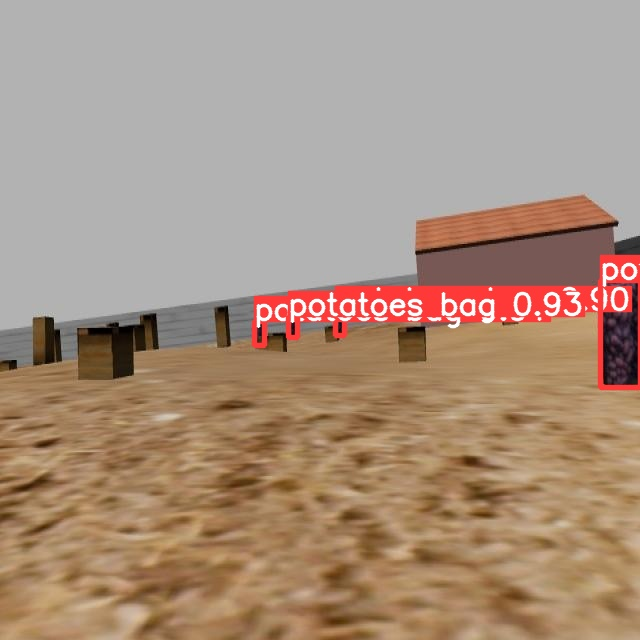
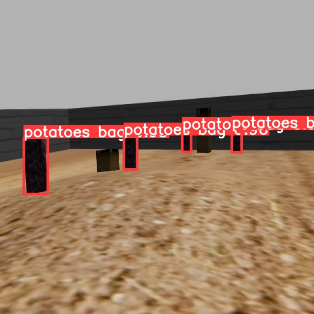
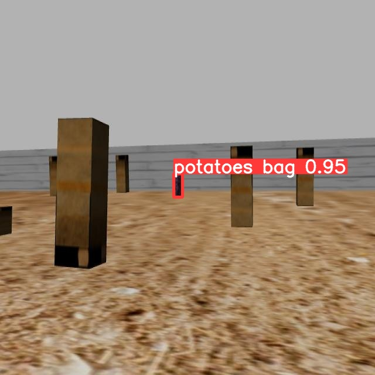

# YOLOv5
Для обнаружения мешков была выбрана модель YOLOv5s. Для обучения был собран датасет
[iprofi-2023](https://universe.roboflow.com/vvlad1slavv/iprofi-2023). Обучение для применении происходило с помощью [python notebook](https://github.com/ultralytics/yolov5/wiki/Train-Custom-Data
) от команды разработчиков yolov5. 

На скромном датасете, в первую итерацию он насчитывал чуть больше 100 картинок, были продемострированы хорошие результаты. Был замечен недостаток при распозновании в упор, в итоге в датасет были добавлены ещё и такие снимки.

  
   
  

# SBPLLatticePlanner
Для решения задач глобального планирования движения использовался SBPLLatticePlanner. Для генерации специальных файлов расширеня .mprim можно воспользоваться приложенным скриптом [ackermann2.m](configs/movebase/primitives/ackermann2.m). Аналогичные скрипты можно найти в репозитории[rbcar_common](https://github.com/RobotnikAutomation/rbcar_common).

# robot_localization
Для одометрии использовался тот же пакет robot_localization, что и в оригинальном репозитории [rbcar_common](https://github.com/RobotnikAutomation/rbcar_common) или же в его [форке](https://github.com/be2rlab/rbcar_common) для олимпиды. Были насторены конфиги, чтобы drift был незначительным или даже отсутсвовал. Сложно сказать точно, в симуляции не был доступен ground truth.

Проблема оригинальной одометрии также состояла в неправильном имени топика колесной одометрии... вместо **/robot/odom** было **/robot/robotnik_base_control/odom**

# move_base
Конфиги были также взяты с репозитория [rbcar_common](https://github.com/RobotnikAutomation/rbcar_common)

# RTAB-map ¯\\_(ツ)_/¯
rtab как rtab  ʕ ᵔᴥᵔ ʔ